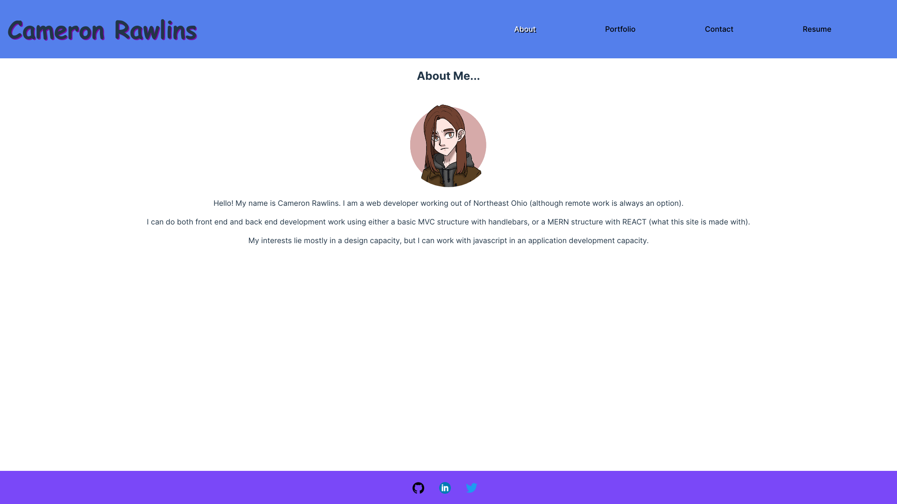

# React-Portfolio-Project 

## Description

Utilizing React, this project was used to update my portfolio using React as the framework. It includes an About Me, Portfolio, Contact, and Resume section.

## Table of Contents

1. [Usage](#usage)
2. [License](#license)
3. [Credits](#credits)
4. [Questions](#questions)
5. [Screenshot](#screenshot)

## Usage

This site doubles as both a portfolio and also to display my ability to use React.

[Here](https://cameronrawlins-portfolio.netlify.app) is the deployed website for your convenience.

## License

This project is protected under the MIT license

## Credits

Using the React base you get by creating a Vite app, I (Cameron Rawlins) made this React app by myself.

## Questions

Q: What is your Github? A: My github is [GameCatCam](www.github.com/GameCatCam).

Q: What is your email? A: My email is cameronrawlins11@gmail.com.

## Screenshot

